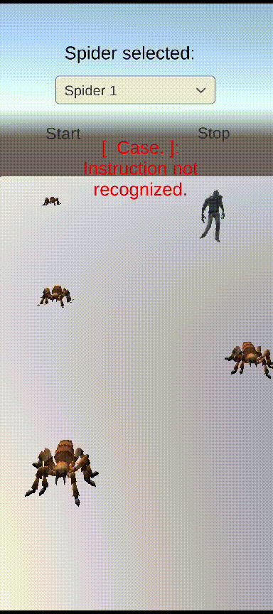

# II-P10-Voice-Recognition

Para esta práctica hemos usado la API de HugginFace para poder aplicar reconocimiento de habla a nuestros proyectos de Unity

Primero, se ha seguido un breve tutorial para poder usar la escena de ejemplo que traía el paquete de HugginFace para Unity:

En el segundo ejercicio, se han creado 2 instrucciones para las arañas, que se reconocerán por comandos de voz y una vez detectadas, se ejecutarán. Se han creado 2 instrucciones:
- Chase: Hace que la araña seleccionada se mueva hacia el zombie.
- Grow: Hace que la araña seleccionada se haga más grande.

